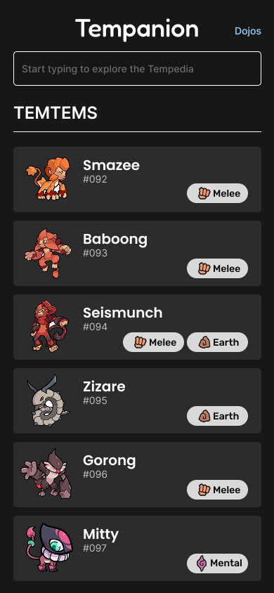
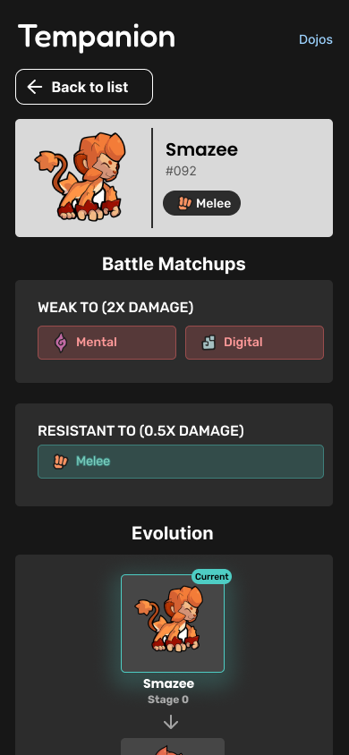
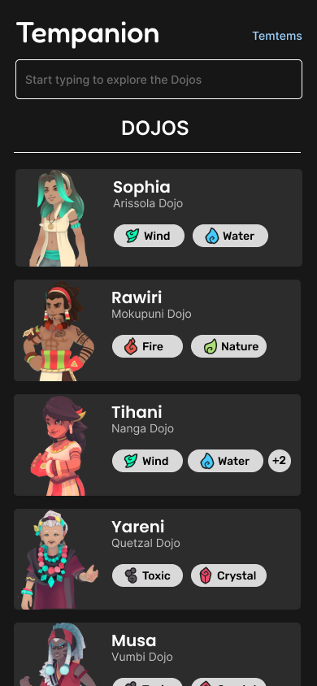
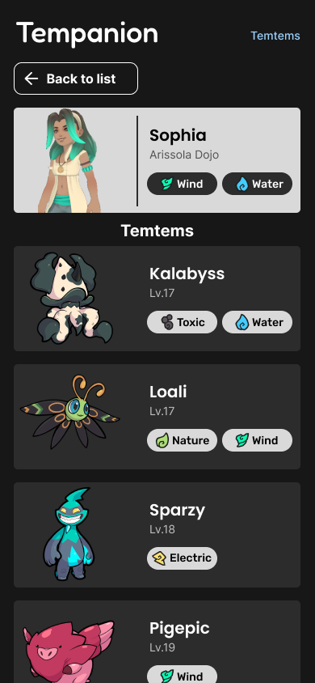

# Tempanion

A comprehensive Temtem companion app for players transitioning from Pokémon or anyone needing a quick reference guide. Tempanion provides instant access to Temtem data, type effectiveness, evolutions, and dojo information - perfect for on-the-go battles and team planning.

## 🎮 Features

### 📚 Tempedia
- **Complete Temtem Database**: Browse all Temtem with detailed stats and information
- **Evolution Chains**: Visual evolution paths and requirements
- **Type Effectiveness**: Weaknesses and resistances for strategic battle planning
- **Quick Search & Filter**: Find specific Temtem instantly

### 🏛️ Dojo Guide  
- **Dojo Master Directory**: Complete list of all dojo masters and their specialties
- **Team Compositions**: View each master's full Temtem lineup with levels
- **Type Specializations**: Know what to expect before challenging each dojo
- **Strategic Planning**: Plan your team counters in advance

### ⚡ Built for Speed
- **Offline-First**: Smart caching system works without internet after initial load
- **Lightning Fast**: Vanilla JavaScript for maximum performance
- **Mobile Optimized**: Perfect companion app for handheld gaming

## 🚀 Why Tempanion?

Coming from Pokémon? Temtem's type system has some key differences that can catch you off guard. Tempanion makes the transition smooth by providing instant access to:

- **Dual-type interactions** that work differently than Pokémon
- **New type combinations** not found in other creature collectors  
- **Dojo master strategies** to help you prepare effective counter-teams
- **Evolution requirements** that may be more complex than simple leveling

## 📸 Screenshots

<!-- Add screenshots of your app -->





## 🛠️ Technologies Used

- **Frontend**: Vanilla JavaScript, HTML5, CSS3
- **Data Management**: JSON files with localStorage caching
- **Performance**: 7-day smart caching with minimal data extraction
- **Design**: Responsive CSS Grid/Flexbox layout
- **Architecture**: Static web app - no server required

## 📁 Project Structure

```
Tempanion/
├── index.html              # Tempedia (main Temtem list)
├── dojos.html              # Dojo masters list
├── dojo-detail.html        # Individual dojo master details
├── temtem-detail.html      # Individual Temtem details
├── css/
│   └── styles.css          # Main stylesheet
├── js/
│   ├── temtem.js          # Tempedia functionality
│   ├── temtem-detail.js   # Temtem detail page logic
│   ├── dojos.js           # Dojo listing functionality
│   └── dojo-detail.js     # Dojo detail page logic
├── data/
│   ├── temtems.json       # Complete Temtem database
│   └── dojos.json         # Dojo masters and their teams
└── images/
    ├── temtems/           # Temtem sprites (001.png, 002.png, etc.)
    ├── dojos/             # Dojo master portraits
    └── types/             # Type icons (Mental.png, Fire.png, etc.)
```

## 🚀 Getting Started

### Prerequisites

- A modern web browser
- Local web server (for development)

### Installation

1. Clone the repository:
   ```bash
   git clone https://github.com/your-username/tempanion.git
   ```

2. Navigate to the project directory:
   ```bash
   cd tempanion
   ```

3. Start a local web server:
   
   **Using Live Server (VS Code):**
   - Install Live Server extension
   - Right-click `index.html` → "Open with Live Server"

4. Open your browser and visit `http://localhost:8000`

## 💡 Key Features in Detail

### Smart Data Management
- **Efficient Type Lookups**: O(1) access to type effectiveness data
- **Minimal Memory Usage**: Only caches essential Temtem information
- **Cross-Reference System**: Links Temtem data with dojo information seamlessly
- **7-Day Cache Expiration**: Balances performance with data freshness

### Battle-Ready Information
- **Complete Type Chart**: All type interactions at your fingertips
- **Stat Comparisons**: Make informed decisions about team composition
- **Evolution Planning**: Know exactly when and how your Temtem will evolve
- **Dojo Preparation**: See each master's team before you challenge them

### User Experience
- **One-Click Navigation**: Jump between related Temtem and dojo information
- **Visual Type Indicators**: Quickly identify types with color-coded icons
- **Mobile-First Design**: Perfect for use while gaming on handheld devices
- **Instant Search**: Find any Temtem or dojo master in milliseconds

## 🎯 Perfect For

- **Pokémon Veterans** learning Temtem's unique type system
- **New Players** who want comprehensive reference material
- **Competitive Players** planning optimal team compositions
- **Casual Players** who want quick battle help during gameplay

### Data Updates
Replace JSON files in the `data/` folder to update Temtem or dojo information as the game evolves.

## 📝 License

This project is licensed under the MIT License - see the [LICENSE](https://opensource.org/license/mit) file for details.

## ⚠️ Disclaimer

Tempanion is a fan-made companion app. All Temtem game data, images, and assets belong to [Crema Games](https://crema.gg). This project is not affiliated with or endorsed by Crema Games.

## 🙏 Acknowledgments

- **Crema Games** for creating the amazing world of Temtem
- **Temtem Community** for data verification and feedback  
- **Pokémon Trainers** making the jump to Temtem - this one's for you!

## 📧 Contact

Project Link: [https://github.com/mrzosia/tempanion](https://github.com/mrzosia/tempanion)

---

⭐ Star this project if Tempanion helped you catch 'em all in the Airborne Archipelago!
